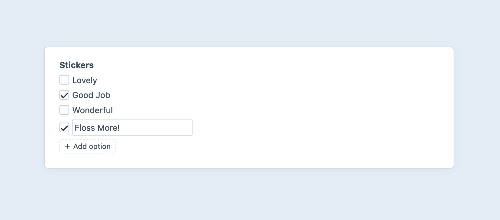

---
related:
  - uri: multi-select.md
    label: Multi-select fields
  - uri: radio-buttons.md
    label: Radio buttons fields
---

# Checkboxes Fields

Checkboxes fields give you a group of [checkbox](https://developer.mozilla.org/en-US/docs/Web/HTML/Element/input/checkbox) inputs, and allow the author to select multiple values (or provide any number of custom values, when allowed).

<!-- more -->



## Settings

<BrowserShot
  url="https://my-craft-project.ddev.site/admin/settings/fields/new"
  :link="false"
  :max-height="500"
  caption="Adding a new checkboxes field via the control panel.">

</BrowserShot>

In addition to the standard field options, checkboxes fields have the following settings:

- **Checkbox Options** – Define the options that will be available to authors. Each option contains a **Label** (shown to the author) and a **Value** (saved to the database), as well as a checkbox indicating whether it should be selected by default.
- **Allow custom options** <Since ver="5.5.0" feature="Custom options" /> — Whether authors can provide “other” options, on-the-fly.

## Development

### Querying Elements with Checkboxes Fields

When [querying for elements](../../development/element-queries.md) that have a checkboxes field, you can filter the results using a query param named after your field’s handle. Possible values include:

| Value | Fetches elements…
| - | -
| `'foo'` | with a `foo` option checked (or `foo` provided as a custom value).
| `'not foo'` | without a `foo` option checked  (and without `foo` among custom values).
| `['foo', 'bar']` | with `foo` _or_ `bar` options selected (or `foo` provided as a custom value).
| `['and', 'foo', 'bar']` | with `foo` _and_ `bar` options selected (or among provided custom values).

::: code
```twig
{# Fetch entries with the 'foo' option checked #}

```
```php
// Fetch entries with the 'foo' option checked
$entries = \craft\elements\Entry::find()
    ->myFieldHandle('foo')
    ->all();
```
:::

### Working with Checkboxes Field Data

If you have an element with a checkboxes field in your template, you can access its data using the field’s handle:

::: code
```twig

```
```php
$value = $entry->myFieldHandle %}
```
:::

That will give you a <craft5:craft\fields\data\MultiOptionsFieldData> object that contains information about the selected values and the available options. This object can be used as an array; looping over it provides each selected option, in sequence:

::: code
```twig

  Label: {{ option.label }}
  Value: {{ option }} or {{ option.value }}

```
```php
foreach ($entry->myFieldHandle as $option) {
    // label: $option->label
    // value: $option or $option->value
}
```
:::

To loop through all available options, iterate over the [options](craft5:craft\fields\data\MultiOptionsFieldData::getOptions()) property:

::: code
```twig

  Label:   {{ option.label }}
  Value:   {{ option }} or {{ option.value }}
  Checked: {{ option.selected ? 'Yes' : 'No' }}

```
```php
foreach ($entry->myFieldHandle->options as $option) {
    // label:   $option->label
    // value:   $option or $option->value
    // checked: $option->selected ? 'Yes' : 'No'
}
```
:::

::: warning

:::

To see if any options are checked, use the [length](https://twig.symfony.com/doc/3.x/filters/length.html) filter or [empty](https://twig.symfony.com/doc/3.x/tests/empty.html) test (or the [count](https://www.php.net/manual/en/function.count.php) method in PHP):

::: code
```twig

  {# At least one option was selected! #}



  {# Equivalent, but note that we’ve inverted the condition! #}

```
```php
if (count($entry->myCheckboxesFieldHandle)) {
    // At least one option was selected!
}
// PHP’s `empty()` function is more strict than the
// Twig test, and may produce different results!
```
:::

To see if a specific option is checked, call [contains()](craft5:craft\fields\data\MultiOptionsFieldData::contains()) using the **Value** in question:

::: code
```twig

  {# `foo` was selected! #}

```
```php
if ($entry->myCheckboxesFieldHandle->contains('foo')) {
    // `foo` was selected!
}
```
:::

The `in` Twig test is equivalent:

```twig

  {# `foo` was selected! #}

```

Custom values are also honored by both methods.

### Saving Checkboxes Fields

In an element or [entry form](kb:entry-form) that needs to save a value to a checkboxes field, you can use this template as a starting point:

```twig


{# Include a hidden input first so Craft knows to clear the
   existing value, if no checkboxes are checked. #}
{{ hiddenInput('fields[myCheckboxesFieldHandle]', '') }}

<ul>
  {# Display native options as checkboxes: #}
  
    

    <li>
      <label>
        <input
          type="checkbox"
          name="fields[myCheckboxesFieldHandle][]"
          value="{{ option.value }}"
          checked>
        {{ option.label }}
      </label>
    </li>
  

  {# Does this field allow custom options? #}
  
    {# Loop over the *stored* values and output all the "invalid" ones as text fields: #}
    
      <li>
        <label>
          <input
            type="text"
            name="fields[myCheckboxesFieldHandle][]"
            value="{{ option.value }}">
          {{ option.label }}
        </label>
      </li>
    

    {# Provide one more input for new values: #}
    <li>
      <label>
        Other:
        <input
          type="text"
          name="fields[myCheckboxesFieldHandle][]">
      </label>
    </li>
  
</ul>
```
