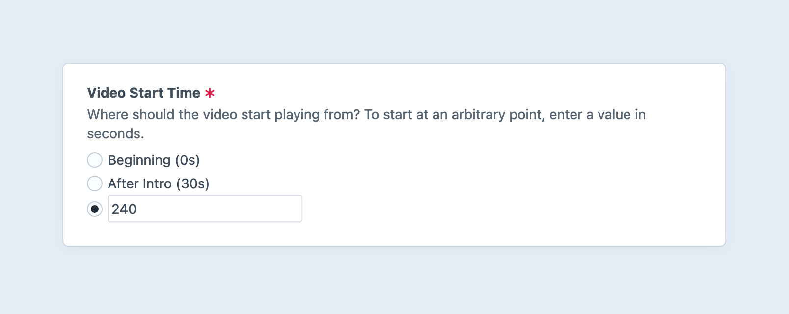

# Radio Buttons Fields

Radio buttons fields give you a group of [radio](https://developer.mozilla.org/en-US/docs/Web/HTML/Element/input/radio) inputs, and allow the author to select a single value (or provide a custom one, when allowed).

<!-- more -->



## Settings

<BrowserShot
  url="https://my-craft-project.ddev.site/admin/settings/fields/new"
  :link="false"
  :max-height="500"
  caption="Adding a new radio buttons field via the control panel.">

</BrowserShot>

In addition to the standard field options, radio buttons fields have the following settings:

- **Radio Button Options** — Define the options that will be available to authors. Each option contains a **Label** (shown to the author) and a **Value** (saved to the database), as well as a checkbox indicating whether it should be selected by default.
- **Allow custom options** — Whether authors can define an “other” option, on-the-fly.

## Development

### Querying Elements with Radio Buttons Fields

When [querying for elements](element-queries.md) that have a radio buttons field, you can filter the results using a query param named after your field’s handle. Possible values include:

| Value | Fetches elements…
| - | -
| `'foo'` | with the `foo` option selected (or a custom value of `foo`).
| `'not foo'` | without the `foo` option selected (or a custom value of `foo`).
| `['foo', 'bar']` | with either the `foo` or `bar` options selected (or a custom value of `foo`).
| `['not', 'foo', 'bar']` | without either the `foo` or `bar` options selected (or a custom value of `foo`).

::: code
```twig
{# Fetch entries with the 'foo' option selected #}

```
```php
// Fetch entries with the 'foo' option selected
$entries = \craft\elements\Entry::find()
    ->myRadioFieldHandle('foo')
    ->all();
```
:::

### Working with Radio Buttons Field Data

If you have an element with a radio buttons field in a template, you can access its data using the field’s handle:

::: code
```twig

```
```php
$value = $entry->myRadioFieldHandle;
```
:::

That will give you a <craft5:craft\fields\data\SingleOptionFieldData> object that contains information about the selected value and available options.

Outputting the object casts it to a string, which is equivalent to directly accessing its [value](craft5:craft\fields\data\SingleOptionFieldData::$value) property:

::: code
```twig
{{ entry.myRadioFieldHandle }} or {{ entry.myRadioFieldHandle.value }}
```
```php
$entry->myRadioFieldHandle; // -> craft\fields\data\SingleOptionFieldData
$entry->myRadioFieldHandle->value; // -> string
```
:::

To check if _any_ option is selected, you must test the [value](craft5:craft\fields\data\SingleOptionFieldData::$value) property, explicitly:

::: code
```twig

  {# Yep, a value was selected! #}

```
```php
if ($entry->myRadioFieldHandle->value) {
  // Yep, a value was selected!
}
```
:::

To show the selected option’s _label_, use the [label](craft5:craft\fields\data\SingleOptionFieldData::$label) property:

::: code
```twig
{{ entry.myRadioFieldHandle.label }}
{# "The selected option’s user-facing label!" #}
```
```php
$entry->myRadioFieldHandle->label; // -> "The selected option’s user-facing label!"
```
:::

::: warning
If the author provided a custom value, no label will be available.
:::

To loop through all the available options, iterate over the [options](craft5:craft\fields\data\SingleOptionFieldData::getOptions()) property. The selected option’s `selected` property will be `true`.

::: code
```twig

  Label: {{ option.label }}
  Value: <code>{{ option.value }}</code>
  Selected: {{ option.selected ? 'Yes' : 'No' }}

```
```php
foreach ($entry->myRadioFieldHandle->options as $option) {
    $option->label;
    $option->value;
    $option->selected ? 'Yes' : 'No';
}
```
:::

If the author provides a “custom” value, no `option` will be marked as `selected`.

### Saving Radio Buttons Fields

In an element or [entry form](kb:entry-form) that needs to save a value to a radio buttons field, you can use this template as a starting point:

```twig


<ul>
  
    

    <li><label>
      <input type="radio"
        name="fields[myRadioFieldHandle]"
        value="{{ option.value }}"
         checked>
      {{ option.label }}
    </label></li>
  
</ul>
```
